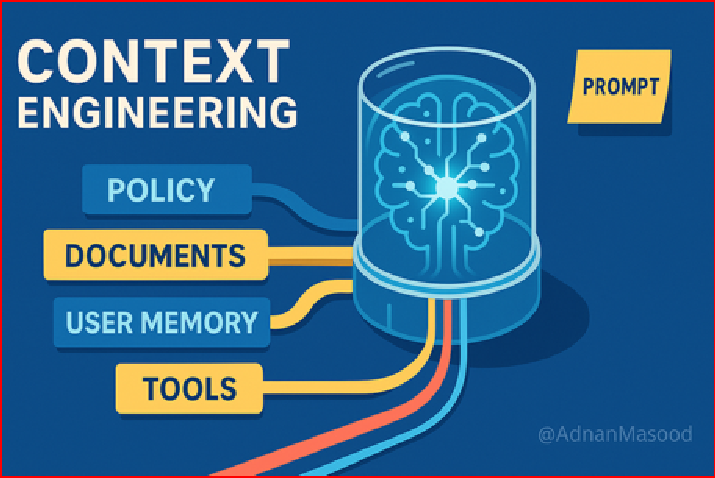

  
  <h1 style="font-size: 2.5em; margin-bottom: 0.2em;">Context engineering</h1>
  
providing the right information, in the right format, at the right time, to maximize the effectiveness of LLMs and AI systems

1. System Instructions - initial set of rules or guidelines
2. User Prompt
3. - Short-term Memory - conversation history
   - Long-term Memory - Persistent knowledge, such as user preferences or summaries from past interactions
4. Retrieved Information - external data pulled from docs, DBs, APIs
5. Available Tools - functions & APIs
6. Structured Output Requirements - specs for formatting responses
7. For agents - Long-Running Tasks, Context Window Management, Dynamic Context Assembly
8. Agent Performance is often limited by how well its context is engineered, not by the model itself. Poor context management can lead to hallucinations, conflicting information, or degraded performance. As agents become more complex, systematic context engineering becomes essential for reliability and scalability
